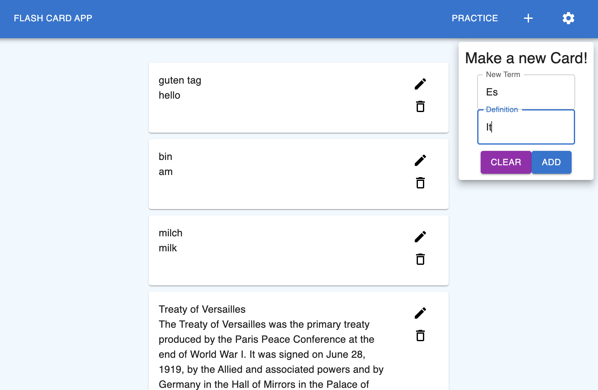
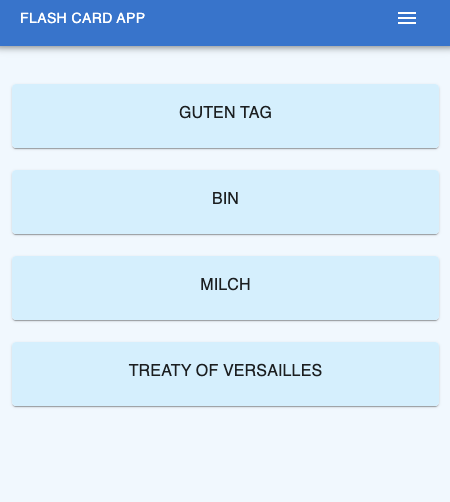
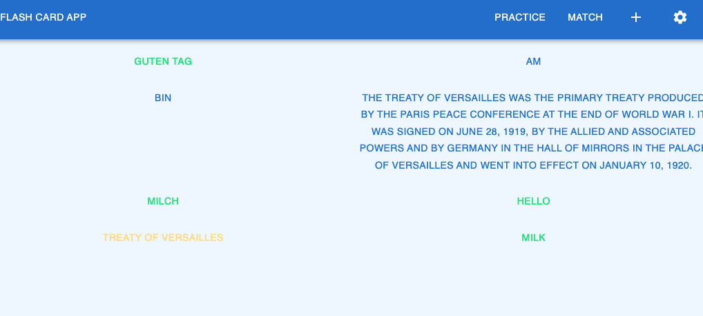

# Flashcard Application

Mern application for creating flashcards for studying.
Deploy a quizlet inspired application with matching games.

### Desktop Mode

### Mobile Responsive

<figcaption ><b>Flashcards can be clicked to flip over to definition</b></figcaption>

### Matching Game

## Capablities

- Flippable Cards
- Responsive Function
- CRUD

## Future updates

- ~~matching game~~
- ~~Flippable function~~
- ~~responsive function~~

# App Stack

- Mongo db via mongoose
- express js
- react
- node js

#### other packages

- Material UI
- react thunk, react redux, BrowserRouter
- axios
- nodemon
- dotenv
